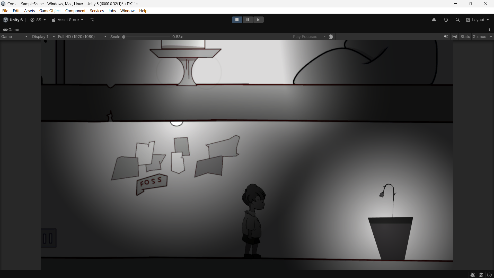
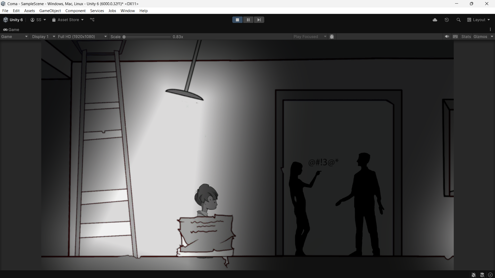

# Revisit - A Story-Driven 2D Game

## 📖 About the Game

**Revisit** is an emotional, narrative-driven 2D side-scrolling adventure that takes players on a reflective journey through the protagonist's life after death. The game explores themes of **struggle, fear, self-realization, and acceptance**, delivering a deeply immersive and heartfelt experience.

## 🌟 Features

- **Genre:** Story-driven, emotional narrative
- **Gameplay:** 2D side-scrolling adventure with interactive storytelling
- **Engine:** Unity
- **Programming Language:** C#
- **Graphics:** Designed using Photopea

## 🎮 Gameplay Overview

### 🧒 Stage 1 (Age 5) - Innocence & Escape
The protagonist, as a child, witnesses a heated argument between their parents. To escape the overwhelming situation, they hide, leading to an unexpected and heartwarming discovery.

### 🏫 Stage 2 (Age 13) - Rebellion & Struggle
During a classroom scene, the protagonist is scolded by their teacher. Overcome with frustration, they flee the school, navigating various obstacles along the way.

### 🤯 Stage 2.5 (Age 13 - Scene 2) - Self-Reflection & Anxiety
On their way home, the protagonist grapples with deep self-reflection and the uncertainties of life, leading to a pivotal moment of introspection.

### 🎵 Stage 3 (Age 23) - Music & Connection
A unique musical gameplay sequence unfolds, culminating in a serene moment where the protagonist meets someone who brings joy and meaning into their life.

### 🎂 Stage 4 (Age 35) - Celebration & Family
The gameplay begins with a **cake-decorating minigame**. Afterward, the protagonist celebrates their child’s **5th birthday** alongside their spouse, cherishing the joys of family life.

### 🏃 Stage 5 (Age 46 - Final Stage) - Tension & Fate
Returning home from a shop, the protagonist is **chased by two robbers**. The player must navigate the tense escape, leading to the game's climactic and thought-provoking conclusion.

## screenshots

## trailer
[Watch the Trailer](trailer.mp4)

## 🤝 Contributing

We welcome contributions to make **Revisit** even better! You can:

1. **Fork** the repository
2. **Submit** a pull request
3. **Report** issues or suggest new features in the Issues tab

## 📜 License

This project is licensed under the **MIT License**.

🔹 Developed with ❤️ using **Unity & C#**

